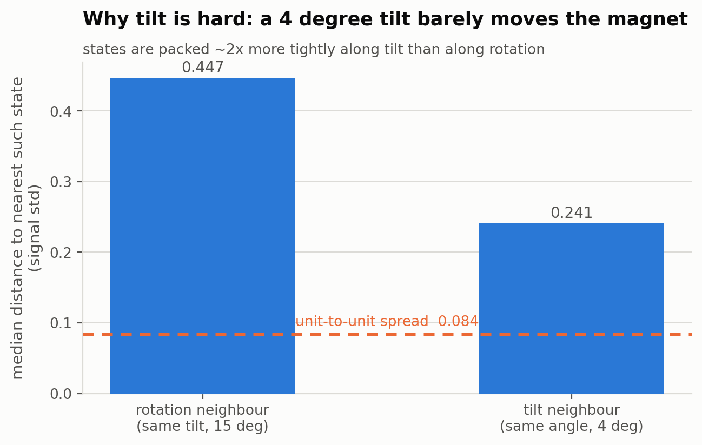
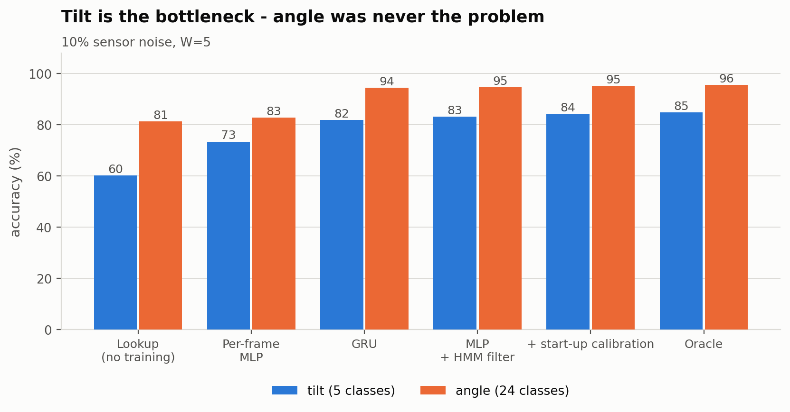
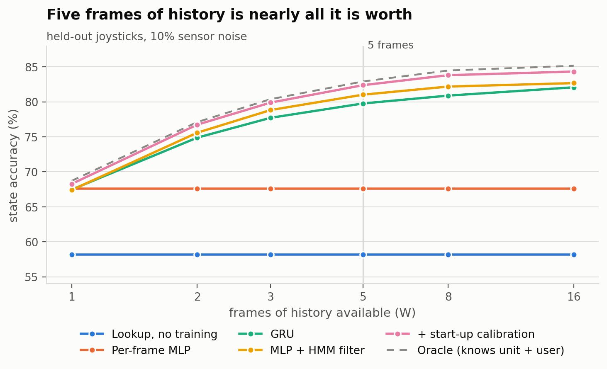
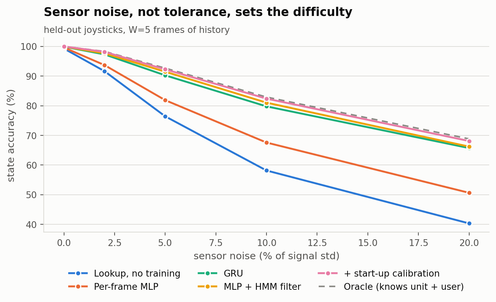
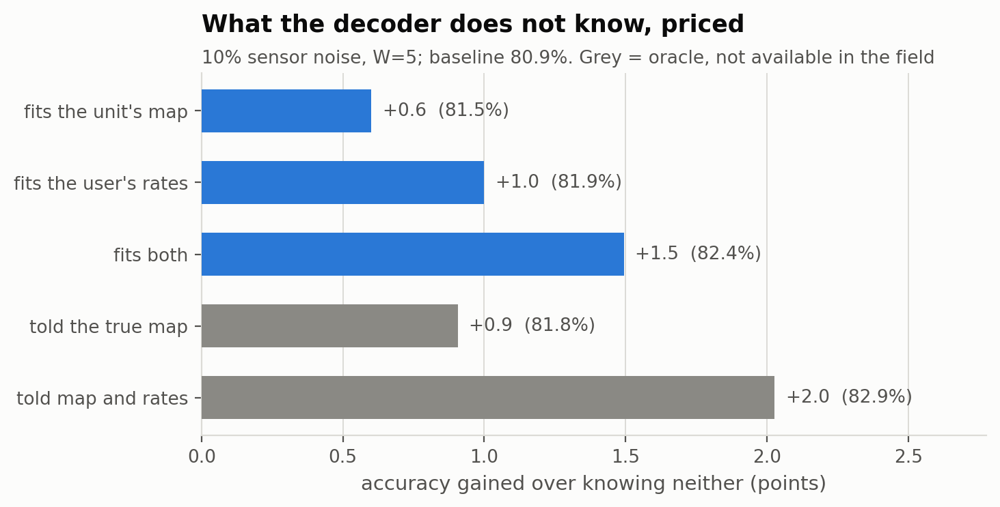
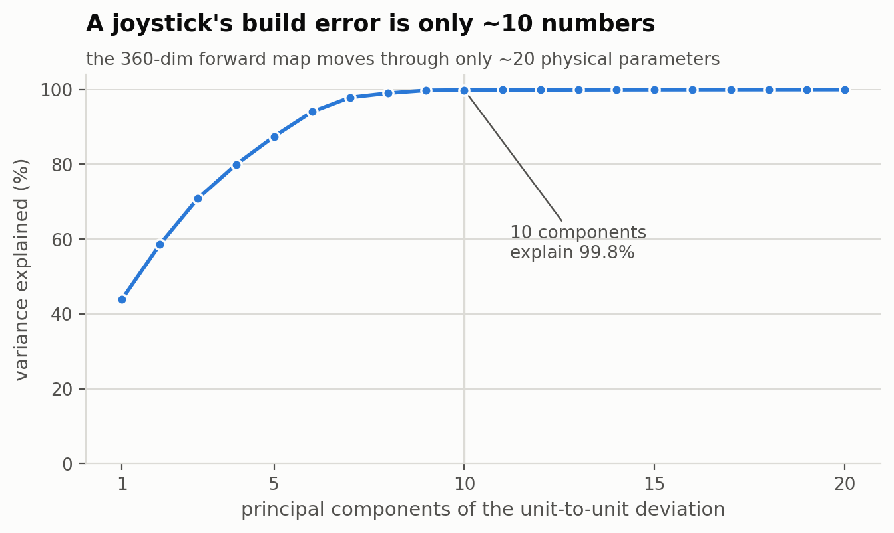
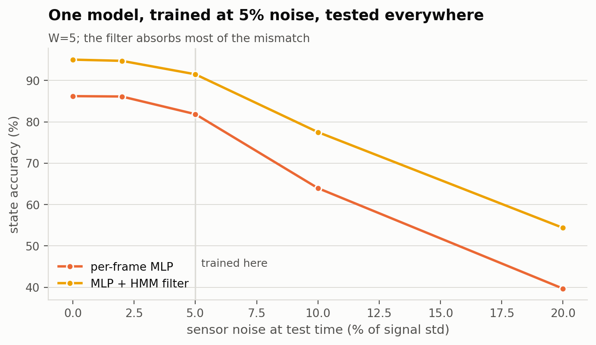

# Recovering joystick position from a magnetic field reading

**A study of how to invert the sensor, what limits it, and what to build.**

Figures: `figures/*.png` (slides) and `*.svg` (vector). Regenerate with
`uv run figures.py`. Full numeric tables: [BENCHMARKS.md](BENCHMARKS.md).

---

## 1. The problem

A joystick carries four magnets over a 3-axis magnetometer. Tilting or rotating
the stick moves the magnets, so the reading `[Bx, By, Bz]` is a function of the
stick's position. We want the inverse: reading → position.

Position is discretised into **120 states** — 5 tilts (ground, N, S, E, W) ×
24 rotation angles at 15° each. The forward map is one 120-entry table per
joystick, produced by the magpylib simulation in `joystick.py`.

Inverting that table would be trivial if the table were known and the reading
were clean. Neither holds in the field, and the study is about what that costs:

| unknown | why it is unknown | modelled as |
|---|---|---|
| **the sensor reading** | thermal and electrical noise | Gaussian, 0–20% of signal std |
| **the unit** | build tolerances: magnet and sensor positions to 0.1 mm, orientations to 0.1° | 800 train / 200 val / 200 test joysticks, disjoint |
| **the user** | people rotate, tilt and hold at different rates, and differently from session to session | hierarchical Dirichlet per unit, then per session |
| **the history** | a decoder holds a few recent samples, not a whole session | scored on the newest frame of a W-frame window |

Nothing below is told which unit it is running on or how that user moves.
Rows labelled *oracle* are given those answers to price what everything else
is missing.

---

## 2. What limits accuracy

### 2.1 Tilt is the whole problem



A rotation step turns the magnets 15°; a tilt deflects them 4°. In field space
the states are therefore packed about **twice as tightly along tilt** as along
rotation — 0.241 vs 0.447 signal std to the nearest such neighbour. For 80 of
the 120 states the single closest confusable state is a pure tilt error at the
same angle, and the closest pair in the whole table is 0.010 signal std apart,
which no amount of processing separates from one sample.

Every method inherits this. Angle accuracy runs 10–20 points above tilt
accuracy throughout, and the headline number is essentially the tilt number.



### 2.2 Build tolerance is real but secondary

The reading for a *fixed* state moves 0.084 signal std between units — visible
in the geometry figure as the dashed line, well below the 0.241 spacing that
matters. So a single fixed decoder still works across a population: a plain
lookup against the average unit gets **99.3%** at zero sensor noise. Tolerance
sets a floor, it does not break the approach.

---

## 3. Results

### 3.1 A single reading is not enough, and history saturates fast



At 10% sensor noise, a per-frame network reads **67.6%**. Giving the same
network's output to a filter that knows the stick cannot teleport takes it to
**81.0%** with five frames. Beyond that the curve flattens: sixteen frames
buys only 1.7 further points.

The reason is structural. From any state only about seven of the 120 are
reachable in one step, so two or three frames already collapse most of the
ambiguity. **A short buffer is not a meaningful handicap.**

> **Note for a real implementation.** The W sweep measures a *cold start*. A
> recursive filter carries a 120-number belief vector and never re-reads past
> samples, so in steady state its memory is unbounded at constant cost. The
> only method here that genuinely needs a reading buffer is the GRU.

### 3.2 The dynamics are worth more than the network

At W=5 and 10% noise:

| decoder | tilt | angle | **state** |
|---|---|---|---|
| Lookup vs average unit, no training | 60.3 | 81.3 | **58.2** |
| Per-frame MLP | 73.5 | 82.8 | **67.6** |
| GRU over the window | 81.9 | 94.4 | **79.8** |
| Physics emission + HMM filter *(no training at all)* | 83.1 | 94.5 | **80.9** |
| Per-frame MLP + HMM filter | 83.3 | 94.6 | **81.0** |
| **+ start-up self-calibration** | **84.4** | **95.3** | **82.4** |
| *Oracle: told the unit and the user* | *84.8* | *95.6* | *82.9* |

Two things stand out.

**Telling a decoder the transition rules beats making it learn them.** The GRU
was trained on the same data and had every opportunity to discover the
dynamics; it lands 1.2 points below a filter that is simply handed them, and
costs far more to train and run.

**The network is a convenience, not an accuracy win.** The learned emission
(81.0) and the physics emission (80.9) are the same number. The MLP earns its
place by not requiring a forward model at inference — not by being better.

### 3.3 Sensor noise, not tolerance, sets the difficulty



At zero sensor noise everything with temporal context is at or near 100%. The
spread between methods only opens up as the sensor degrades, and by 20% noise
the gap between a raw per-frame read (50.6) and the best decoder (68.1) is
17 points.

### 3.4 What the two unknowns actually cost



Fitting each unknown from the first few seconds of use, with no measurement of
the device:

- **Not knowing the user costs more than not knowing the unit.** True rates on
  top of an already-perfect map are worth +1.1; a perfect map with average
  rates only +0.9. Usage pattern is the bigger prize, and it is the cheaper to
  recover — a few counters against a rank-10 subspace fit.
- **A start-up fit recovers +1.5 of the +2.0 available** (73%), cutting map
  error from 0.037 to 0.026 signal std and rate error from 0.162 to 0.072
  (both mean absolute, in signal std).
- **It matters most when the sensor is good.** At 0% noise the fit closes
  99.7 → 100.0, essentially all of the remaining error; at 20% noise sensor
  noise dominates and the same machinery is worth less.

This works because build error is low-rank — about ten numbers per joystick:



### 3.5 You cannot tune to a noise level you cannot measure



A model trained at 5% noise and deployed elsewhere degrades smoothly, and the
filter absorbs most of the mismatch — at 10% test noise it holds 77.5 against
64.0 for the raw network. Train with noise at or slightly above the worst you
expect, rather than trying to match it.

---

## 4. What to build

> **Per-frame MLP (or the physics map, if you would rather not train anything)
> → HMM forward filter carrying its belief vector across samples → read the
> argmax each frame. Fit the unit's map and the user's rates once at start-up
> and fold them into the emission.**

- Constant time and memory per sample; no reading buffer, no sequence model.
- Roughly a few hundred lines. The filter is ~30 of them.
- Beats every neural sequence model tested, and lands within 0.5 points of an
  oracle that is told both things it cannot know.

**Do not** reach for a bigger per-frame network — it is already at the
information limit of one sample. **Do not** reach for a transformer or a
bidirectional model — both were tried and dropped (dominated, and the offline
ones cannot run on a live device anyway).

---

## 5. Honest limitations

- **Simulation only.** Every number comes from magpylib, not a bench. The
  tolerance model is Gaussian and independent; real production spread may be
  correlated (a mis-set jig moves several magnets together) or have tails.
- **Magnet strength is fixed** across units at the measured values, so
  magnetisation variation is not represented at all. Adding it would widen the
  unit-to-unit spread and lower every number here.
- **Noise is i.i.d. and isotropic.** Real sensors drift and have cross-axis and
  temperature effects, which the filter's persistence assumption would handle
  less gracefully than white noise.
- **The transition model assumes it knows the *population* rates.** It does not
  need per-session rates (that is the point of §3.4), but a user moving far
  outside the training population would be over-smoothed.
- **120 discrete states.** Angle is treated as 24 classes rather than a
  continuous quantity, which discards the fact that class 23 neighbours class
  0. A circular (sin/cos) head is the thing to try for finer resolution.

---

## 6. Reproducing this

```
uv run benchmarks.py     # full sweep, writes BENCHMARKS.md  (~25 min)
uv run figures.py        # regenerate every figure from the cached results
```

Each approach also runs on its own, which is the faster way to iterate:

```
uv run hmm.py            # structured decoding + the oracle ceilings
uv run net_mlp.py        # the per-frame network
uv run net_gru.py        # the causal sequence network
uv run calibration.py    # start-up self-calibration
```

`--smoke` for tiny settings, `--check` for a fast self-test of that module.

| file | role |
|---|---|
| `statespace.py` | what a state is, and how predictions are scored |
| `population.py` | joysticks, usage patterns, trajectories, readings |
| `evaluate.py` | the shared harness every method is run through |
| `nets.py` | torch plumbing shared by the two architectures |
| `hmm.py`, `net_mlp.py`, `net_gru.py`, `calibration.py` | one approach each |
| `report.py`, `figures.py` | BENCHMARKS.md and the figures |

---

## Suggested slide order

| # | Slide | Figure |
|---|---|---|
| 1 | The problem: reading → 1 of 120 positions | — |
| 2 | Three things a real decoder does not know | table, §1 |
| 3 | Why tilt is hard (4° vs 15°) | `05_geometry` |
| 4 | …and it shows in every result | `04_tilt_vs_angle` |
| 5 | One reading is not enough; 5 frames is plenty | `01_history` |
| 6 | Dynamics beat the sequence model | table, §3.2 |
| 7 | How it degrades with sensor noise | `02_noise` |
| 8 | Pricing what we don't know | `03_unknowns` |
| 9 | Why self-calibration is possible at all | `06_tolerance_rank` |
| 10 | Don't tune to a noise level you can't measure | `07_noise_mismatch` |
| 11 | **Recommendation** | §4 |
| 12 | Limitations and next steps | §5 |
